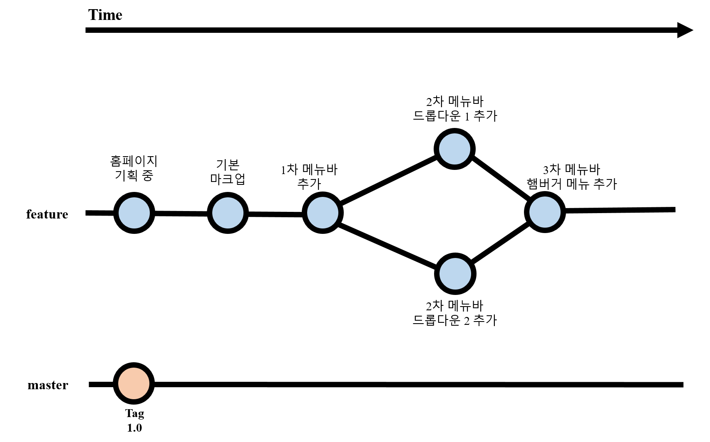
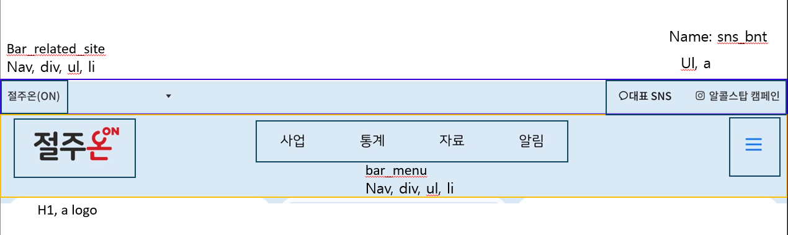

# 🤖 julHeader
이 프로젝트는 [절주온 홈페이지](https://www.khepi.or.kr/alcoholstop)의 header를 클론코딩한 것입니다.


## 🧸Project Proposal

- 홈페이지 기획중 (2025-03-17 fin)
- 기본 마크업 (2025-03-18 ongoing~)
- 1차 메뉴바 추가
- 2차 메뉴바 추가
- 3차 메뉴바 추가


```markdown

🌟 구현 계획 🌟

## 우리의 코드 컨벤션
명명은 카멜 버전으로 하기

## 레이아웃(명명 변경 필요)
헤더1: topbar / snsBnt
헤더2:loGo / menuBar / siteBnt

## 노멀라이즈, 구성

topBar > 드롭다운

menuBar > 사이드바

## 반응 적용 필요
topBar >
커서 색상변경, 하위 메뉴 보이기 > 클릭 시 하위메뉴 펼쳐질 때 다른 요소 영향 안 받게 하기

menuBar >
커서, 하위 메뉴 보이기, 하위 메뉴 미선택 시 절주온에 하이라이트 고정
하위 메뉴 숨김 때에도 공간 확보되게 하기

```

<aside>


### 💡 참고 사이트

1. [드롭다운 메뉴바](https://me-in-journey.com/entry/HTMLCSS-%EB%93%9C%EB%A1%AD%EB%8B%A4%EC%9A%B4-%EB%A9%94%EB%89%B4-%EB%B0%94-%EB%A7%8C%EB%93%A4%EA%B8%B0-2%EC%B0%A8-%EB%A9%94%EB%89%B4-%EB%A7%8C%EB%93%A4%EA%B8%B0-feat-position)

2. [메뉴바 구성 참고 자료료](https://despiteallthat.tistory.com/41)

3. [Java 구현 방법 참고](https://www.youtube.com/watch?v=X91jsJyZofw&t=161s)


<details> 
 <summary> 🐣 1차 레이아웃 초안(17/03/2025)</summary>
 
📄 Header 전체 초안
    

    
📄 Header1: topBar > 드롭다운
    

    
📄 Header2: menuBar > 사이드바
    

</details>


## 👩‍💻 제작자
- [노우정](https://github.com/Woojeong98)
- [양지윤](https://github.com/yoon2fy)
